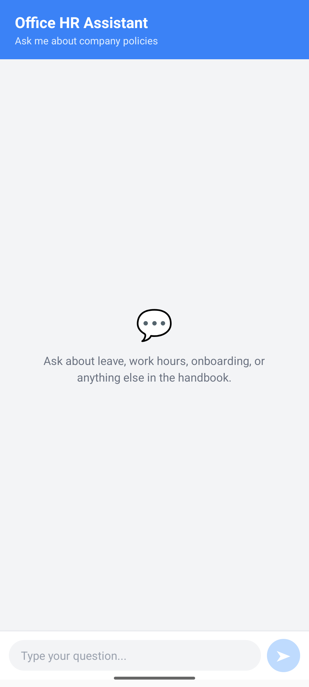
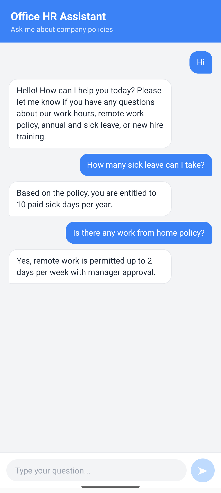

# RAG HR Chatbot — Mobile App

A React Native (bare CLI) chat interface for an AI-powered HR/Onboarding assistant, backed by a Firebase Cloud Functions + Genkit RAG pipeline.

Ask natural-language questions like *"How much work from home is available?"* and get accurate answers grounded in real company policy documents, retrieved via vector similarity search.

## Screenshots

<p float="left">
  
  
</p>

## Tech stack

- **React Native** (bare CLI, TypeScript)
- **`@react-native-firebase/app`** + **`@react-native-firebase/functions`** — calls the backend's callable Cloud Function
- Tested on **Android Emulator**

## Project structure

```
RagOfficeBot/
├── App.tsx                        # Main chat UI + Firebase Functions integration
├── android/app/google-services.json  # (gitignored) Firebase Android config — you must add your own
└── android/
    ├── build.gradle               # Includes Google Services Gradle plugin
    └── app/build.gradle           # Applies the Google Services plugin
```

## Prerequisites

- Node.js (v20+)
- Java JDK 17
- Android Studio + Android SDK + at least one AVD (emulator) created
- `ANDROID_HOME` environment variable configured, with `platform-tools` and `emulator` on your `PATH`
- The backend from **[link to your backend repo]** running locally (Functions Emulator) or deployed

## Setup

1. **Install dependencies**
   ```bash
   npm install
   ```

2. **Register this app in your Firebase project**
   - Go to Firebase Console → Project Settings → Your apps → Add Android app
   - Package name must match `applicationId` in `android/app/build.gradle` (check with `cat android/app/build.gradle | grep applicationId`)
   - Download the generated `google-services.json` and place it at:
     ```
     android/app/google-services.json
     ```
     (This file is gitignored — every developer needs their own copy from the Firebase Console.)

3. **Verify the Google Services Gradle plugin is configured** (already done in this repo, but if starting fresh elsewhere):
   - `android/build.gradle` → `classpath("com.google.gms:google-services:4.4.2")` inside `buildscript { dependencies { ... } }`
   - `android/app/build.gradle` → `apply plugin: "com.google.gms.google-services"` near the top

## Connecting to the backend

`App.tsx` currently points at the **local Functions Emulator**:

```ts
functions().useEmulator('10.0.2.2', 5001);
```

`10.0.2.2` is the special address the Android emulator uses to reach `localhost` on your host machine. Make sure the backend's Functions Emulator is running first (see backend repo's README).

**To use a deployed (production) backend instead**, remove the `useEmulator(...)` line entirely — the SDK will automatically call your deployed Cloud Function.

## Running the app

1. Start an Android emulator:
   ```bash
   emulator -avd YOUR_AVD_NAME
   ```

2. Start Metro (the JS bundler):
   ```bash
   npx react-native start
   ```

3. In a separate terminal, build and launch the app:
   ```bash
   npx react-native run-android
   ```

## Features

- Chat-style UI with message history (user messages right-aligned, bot responses left-aligned)
- Loading indicator while waiting for a response
- Empty-state prompt before the first question
- Auto-scrolls to the latest message

## Related repo

The backend (Firebase Functions + Genkit RAG pipeline) this app depends on lives at: https://github.com/amanLRays/rag-hr-chatbot-backend
